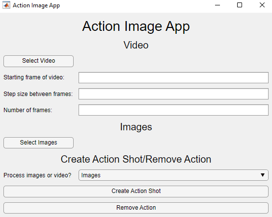
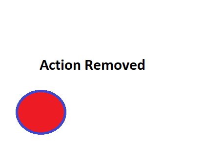
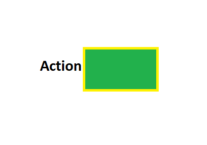
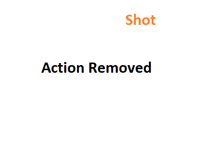
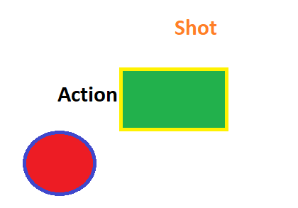
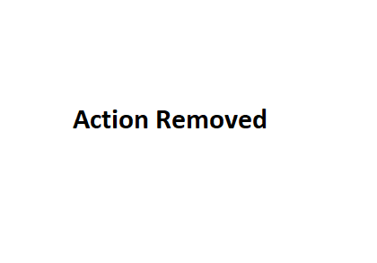

# Action_Image_Processor
Action Image Processor application made using MATLAB. Can be used to generate an action shot image or an image with the action removed from a video or images (the images need to be of the same dimensions).

## Running the application

You can run the executable in the release to run the application.

If you want to open thr source code and run from MATLAB, then open the ActionImageApp (`src/GUI/ActionImageApp.m`) in MATLAB, and run. The utility folder (`src/utility`) and the files in it need to be present for the application to work.

## Application

Upon running, the following GUI will appear:

You can fill it the details and then either generate an image with the action removed or generate the action shot.

## Results

A very simple example of an action shot generated and an image generated with the action removed are as follows.

### Input images

The following three images were input:

1.

2.

3.

### Action Shot Image

The following Action Shot image was generated:

### Removed Action Image

The following image with the action removed was generated:

